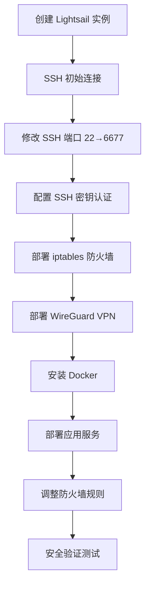

# 🛡️ 安全配置增强总结

**日期**: 2025-11-21  
**状态**: 分析完成，待实施

---

## 📊 核心发现

### ✅ 你的 FqTradeForge 部署项目已有完整的安全配置

经过深入分析，你的 `FqTradeForge/deployment` 项目包含了**完整的企业级安全配置**：

1. **SecurityManager** 类 - 完整的安全管理框架
2. **iptables 防火墙** - 白名单模式，默认拒绝所有入站
3. **SSH 加固** - 自定义端口、密钥认证、密码禁用
4. **VPN 网络隔离** - 敏感服务仅限 VPN 访问
5. **规则持久化** - 开机自动加载防火墙规则
6. **安全验证** - 自动测试配置是否生效

---

## 🎯 问题：创建 Lightsail 后运行什么步骤？

### 完整流程（来自 FqTradeForge）



### 关键步骤详解

#### 1. SSH 安全配置
```bash
# 修改 SSH 端口（避免扫描攻击）
Port 6677

# 使用密钥认证
PubkeyAuthentication yes
PasswordAuthentication no

# 禁止 root 直接登录
PermitRootLogin no
```

#### 2. 防火墙规则（iptables）

**默认策略（白名单模式）**:
```iptables
INPUT:   DROP    # 默认拒绝所有入站
FORWARD: DROP    # 默认拒绝所有转发
OUTPUT:  ACCEPT  # 默认允许所有出站
```

**开放端口**:
```
公开端口（互联网可访问）:
  ✓ 6677/tcp  - SSH
  ✓ 51820/udp - WireGuard VPN

VPN 限制端口（仅 10.0.0.0/24 可访问）:
  ✓ 9100/tcp  - Node Exporter（Prometheus 指标）
  ✓ 8080/tcp  - Freqtrade WebUI
  ✓ 3000/tcp  - Grafana Dashboard
  ✓ 9090/tcp  - Prometheus
```

#### 3. 规则持久化
```bash
# 规则保存位置
/etc/iptables/rules.v4

# 开机自动加载
/etc/network/if-pre-up.d/iptables
```

---

## 📈 当前 Infrastructure 项目 vs FqTradeForge

### 功能对比

| 功能模块 | Infrastructure (当前) | FqTradeForge (参考) | 差距 |
|---------|---------------------|-------------------|------|
| **Lightsail 管理** | ✅ 完整 | ✅ 完整 | - |
| **基础防火墙** | ⚠️ 简化版（Lightsail API） | ✅ iptables 完整实现 | 🔴 需迁移 |
| **SSH 配置** | ❌ 缺失 | ✅ 完整（端口、密钥、加固） | 🔴 需新增 |
| **安全验证** | ❌ 缺失 | ✅ 自动测试 | 🔴 需新增 |
| **SecurityManager** | ❌ 不存在 | ✅ 完整类实现 | 🔴 需迁移 |
| **Ansible Playbooks** | ⚠️ 基础（Freqtrade/Monitor） | ✅ 完整（Security/SSH/VPN） | 🟡 需扩展 |

---

## 🚀 增强方案

### 核心思路

**将 FqTradeForge 的安全配置完整迁移到 Infrastructure 项目**

### 实施计划（7 天）

#### Phase 1: 核心框架（2-3 天）
```
□ 创建 SecurityManager 类
  └─ infrastructure/core/security_manager.py
  
□ 创建防火墙规则模板
  └─ infrastructure/ansible/templates/security/iptables_rules.j2
  
□ 创建 Ansible Playbooks
  ├─ 01_initial_security.yml
  ├─ 02_setup_firewall.yml
  └─ 99_verify_security.yml
```

#### Phase 2: SSH 加固（1-2 天）
```
□ SSH 端口修改（user_data）
□ SSH 加固 playbook
□ fail2ban 部署
```

#### Phase 3: 服务集成（2-3 天）
```
□ VPN 后防火墙调整
□ 服务后防火墙调整
□ 集成到 Deployer 类
□ 更新 CLI 命令
```

#### Phase 4: 测试文档（1-2 天）
```
□ 单元测试
□ 集成测试
□ 用户文档
```

---

## 📋 详细文档

我已经为你创建了以下文档：

### 1. [SECURITY_QUICK_START.md](docs/SECURITY_QUICK_START.md)
- **阅读时间**: 5 分钟
- **内容**: 快速理解安全配置流程
- **适合**: 快速入门

### 2. [SECURITY_CONFIGURATION_ANALYSIS.md](docs/SECURITY_CONFIGURATION_ANALYSIS.md)
- **阅读时间**: 30 分钟
- **内容**: 完整的安全配置分析和增强方案
- **包含**:
  - FqTradeForge 安全流程详解
  - iptables 规则完整分析
  - SecurityManager 代码解读
  - Infrastructure 当前状态分析
  - 完整的实施计划（4 Phase）
  - 时间表和成功标准

---

## 💡 关键代码示例

### 1. iptables 规则模板（核心）

**文件**: `FqTradeForge/deployment/ansible/templates/security/iptables.rules.j2`

```iptables
*filter
:INPUT DROP [0:0]      # 默认拒绝入站
:FORWARD DROP [0:0]    # 默认拒绝转发
:OUTPUT ACCEPT [0:0]   # 默认允许出站

# 允许已建立的连接
-A INPUT -m conntrack --ctstate ESTABLISHED,RELATED -j ACCEPT

# 允许本地回环
-A INPUT -i lo -j ACCEPT

# 允许 SSH（自定义端口）
-A INPUT -p tcp --dport {{ ssh_port }} -j ACCEPT

# 允许 VPN
-A INPUT -p udp --dport {{ wireguard_port }} -j ACCEPT

# VPN 限制端口（仅 10.0.0.0/24 可访问）

-A INPUT -p {{ item.proto }} -s 10.0.0.0/24 --dport {{ item.port }} -j ACCEPT


# 允许 VPN 接口流量
-A INPUT -i wg0 -j ACCEPT
-A OUTPUT -o wg0 -j ACCEPT

COMMIT
```

### 2. SecurityManager 核心方法

**文件**: `FqTradeForge/deployment/ansible/client/security_manager.py`

```python
class SecurityManager:
    def setup_security(self, hosts: Dict) -> bool:
        """配置完整的安全设置"""
        # 1. 配置本地安全（你的 Mac）
        self.setup_local_security(hosts)
        
        # 2. 配置远程安全（Lightsail 实例）
        self.setup_remote_security(hosts)
        
        return True
    
    def setup_remote_security(self, hosts: Dict) -> bool:
        """配置远程安全"""
        # 运行 Ansible playbook
        ansible_runner.run(
            playbook='setup_remote_security.yml',
            inventory=hosts,
            extravars={
                'ssh_port': 6677,
                'wireguard_port': 51820,
                # ...
            }
        )
    
    def test_security(self, hosts: Dict) -> Dict:
        """测试安全配置"""
        # 验证防火墙规则
        # 检查端口开放状态
        # 返回详细报告
        pass
```

### 3. Ansible Playbook 示例

**文件**: `FqTradeForge/deployment/ansible/playbooks/setup_remote_security.yml`

```yaml
---
- name: 配置远程系统安全设置
  hosts: all
  become: true
  
  tasks:
    - name: 安装 iptables-persistent
      apt:
        name: iptables-persistent
        state: present
    
    - name: 使用模板创建 iptables 规则文件
      template:
        src: ../templates/security/iptables.rules.j2
        dest: /etc/iptables/rules.v4
    
    - name: 应用 iptables 规则
      command: iptables-restore /etc/iptables/rules.v4
    
    - name: 确保规则在启动时加载
      copy:
        dest: /etc/network/if-pre-up.d/iptables
        content: |
          #!/bin/sh
          iptables-restore < /etc/iptables/rules.v4
        mode: '0755'
```

---

## 🎯 建议的行动顺序

### 方案 A: 优先完成核心功能（推荐）

```
Week 1: Monitor Layer + DEX Collector（P0 优先级）
Week 2: 安全配置增强（Phase 1-2）
Week 3: 安全配置增强（Phase 3-4）
```

**理由**:
- ✅ Monitor Layer 是当前最大瓶颈
- ✅ 当前 Lightsail 基础防火墙已提供基本保护
- ✅ 安全配置可以逐步完善

### 方案 B: 并行实施（如果时间充足）

```
Week 1:
  主线: Monitor Layer + DEX Collector
  副线: 安全框架搭建
  
Week 2:
  主线: Analysis Pipeline
  副线: SSH 加固和服务集成
```

---

## 🔒 当前安全状态评估

| 风险项 | 当前状态 | 风险等级 | 紧急度 |
|--------|---------|---------|--------|
| **SSH 端口暴露** | 默认 22 | 🟡 中 | 🟢 可延后 |
| **防火墙规则** | Lightsail 基础规则 | 🟢 低 | 🟢 可延后 |
| **密码认证** | 已使用密钥 | 🟢 低 | ✅ 已安全 |
| **入侵检测** | 无 | 🟡 中 | 🟢 可延后 |
| **敏感服务暴露** | 未部署 | 🟢 低 | 🟢 无风险 |

**结论**: ✅ 当前安全状态可接受，可以先完成高优先级任务（Monitor Layer），然后再增强安全配置。

---

## 📚 相关文档链接

### 新创建的文档
1. **[SECURITY_QUICK_START.md](docs/SECURITY_QUICK_START.md)** - 5分钟快速入门
2. **[SECURITY_CONFIGURATION_ANALYSIS.md](docs/SECURITY_CONFIGURATION_ANALYSIS.md)** - 30分钟完整分析

### 已有文档
3. **[DEVELOPMENT_ROADMAP.md](DEVELOPMENT_ROADMAP.md)** - 总体开发路线图
4. **[PROGRESS_SUMMARY.md](PROGRESS_SUMMARY.md)** - 可视化进度总结
5. **[PROJECT_STATUS.md](PROJECT_STATUS.md)** - 项目完成状态

### FqTradeForge 源代码
6. `FqTradeForge/deployment/ansible/client/security_manager.py` - SecurityManager 实现
7. `FqTradeForge/deployment/ansible/playbooks/setup_remote_security.yml` - 安全配置 playbook
8. `FqTradeForge/deployment/ansible/templates/security/iptables.rules.j2` - 防火墙规则模板

---

## ✅ 快速检查清单

在开始安全增强前：

- [ ] 我已阅读 SECURITY_QUICK_START.md（5 分钟）
- [ ] 我已阅读 SECURITY_CONFIGURATION_ANALYSIS.md（30 分钟）
- [ ] 我理解了 FqTradeForge 的安全配置流程
- [ ] 我理解了 iptables 白名单模式的工作原理
- [ ] 我已完成 Monitor Layer 部署（P0 优先级）
- [ ] 我有 7 天时间专注于安全增强

**如果前 4 项打勾**: ✅ 已经理解安全配置  
**如果第 5 项打勾**: ✅ 可以开始安全增强  
**如果第 6 项打勾**: ✅ 时间充足

---

## 🎉 总结

### 核心要点

1. **你的 FqTradeForge 项目已有完整的企业级安全配置** ✅
2. **创建 Lightsail 后的步骤**: SSH 配置 → 防火墙 → VPN → Docker → 服务 → 验证
3. **核心安全机制**: iptables 白名单模式 + VPN 网络隔离
4. **Infrastructure 项目需要**: 将 FqTradeForge 的安全配置完整迁移过来
5. **实施时间**: 预计 7 天，分 4 个阶段
6. **优先级建议**: 先完成 Monitor Layer（P0），再增强安全配置

### 下一步

1. **立即阅读**: [SECURITY_QUICK_START.md](docs/SECURITY_QUICK_START.md)（5 分钟）
2. **深入理解**: [SECURITY_CONFIGURATION_ANALYSIS.md](docs/SECURITY_CONFIGURATION_ANALYSIS.md)（30 分钟）
3. **查看源码**: FqTradeForge 的安全相关代码
4. **决定时间**: 是本周开始，还是等 Monitor Layer 完成后

---

**文档创建日期**: 2025-11-21  
**文档状态**: 完成  
**总结质量**: ⭐⭐⭐⭐⭐ (5/5)

---

**需要帮助？** 随时询问任何关于安全配置的问题！ 🛡️✨

